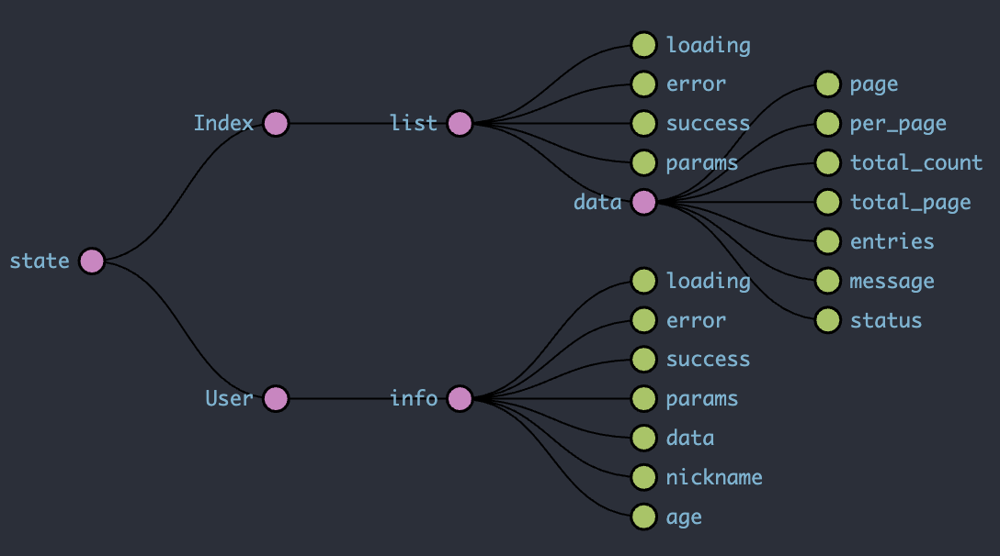

# Mobile App By Taro

> used：Taro、redux、redux-saga、sass、Typescript  (nodejs v10.15.1、@tarojs/cli v2.0.7)

### TaroCli 全局安装 **(必须)**

``` bash
# 使用 npm 安装 CLI
$ npm install -g @tarojs/cli@2.0.7

# OR 使用 yarn 安装 CLI
$ yarn global add @tarojs/cli@2.0.7

# OR 安装了 cnpm，使用 cnpm 安装 CLI
$ cnpm install -g @tarojs/cli@2.0.7
```


### 安装

``` bash
$ npm install / yarn install
```


### 启动

``` bash
$ npm run dev:h5 / yarn dev:h5
```

### 新增路由

```bash
# 务必安装全局工具 soda-bo-cli
$ sbc taropage PageName   # 支持多级目录 例如： sbc taropage User/Update
```


### 编译

``` bash
$ npm run build:** / yarn build:**
```

### 关于数据流

大致流程和BO一致，eg:
```javascript
// pages/Index/redux.ts
export const list = buildRedux('IndexBanner')({
  url: api.login,  // * (payload, {getState}) => '/url'
  method: 'get',
  // *data(payload, { put }) { return {} },  // * 请求发送的数据处理，返回一个新的
  // *onResult(res, payload: IndexBannerPayload, { put }) { return {} },   // * 处理数据返回一个新的数据
  // *onAfter() {},  // * action.success 后 执行的操作
  // *onError() {},  // *  错误处理
})
```
但是 **合并还是需要手动操作**：
```js
// pages/Index/redux.ts
export default combineReducers({
  list: list.reducer,
})
```

state结构图为：



在action方面，提供了全局Action变量：
```js
import { Actions } from 'store/helper/actions'


// IndexBanner 为 buildRedux('IndexBanner') 中的名称
Actions.IndexBanner.start()

```
所以，在 connect 可以只关联state， 即：

```js
@connect((state: TState) => ({
  list: state.Coupon.list
}))
class Coupon extends Component<Props, State> {
  componentDidMount() {
    Actions.IndexBanner.start()
  }
}
```